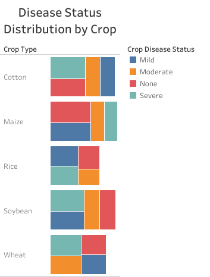
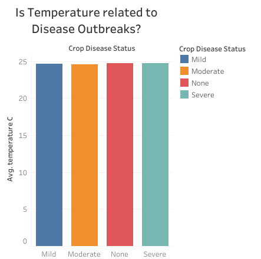
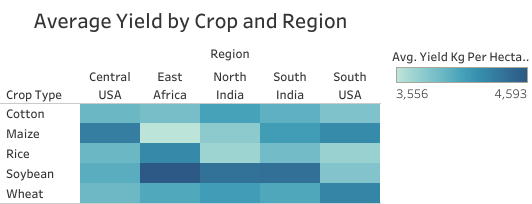
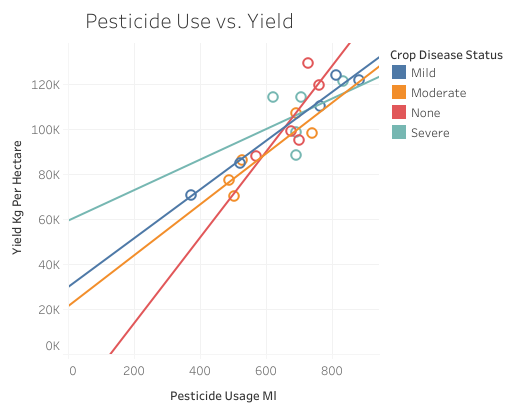
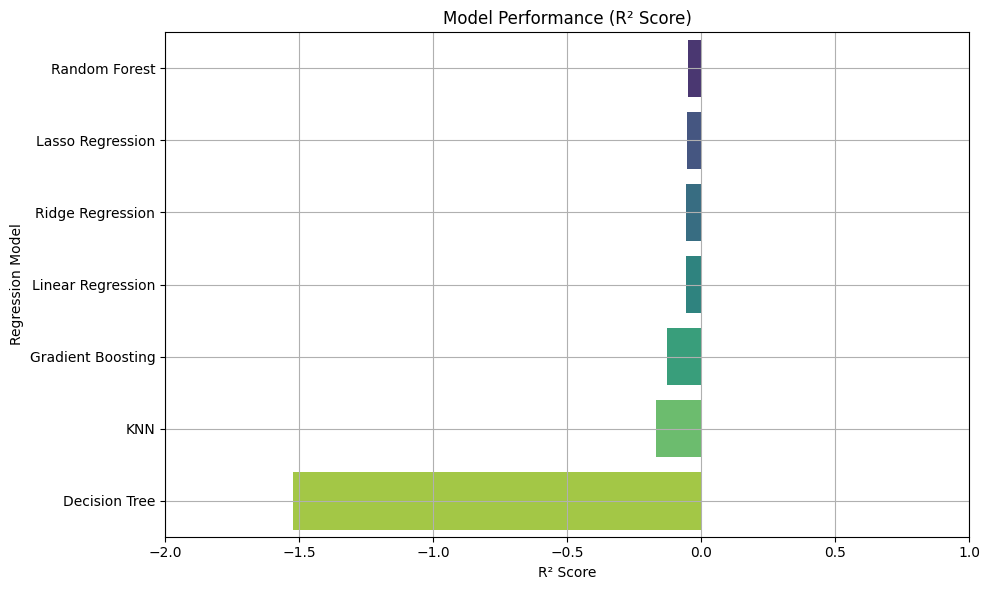

# 🌾 Crop Yield Prediction & Data Exploration Project

This project analyzes crop yield data using **SQL**, **Python (scikit-learn)**, and **Tableau**, combining data exploration and machine learning to understand and predict agricultural productivity. 

## 📊 Project Overview

- **Goal:** Predict crop yield (`yield_kg_per_hectare`) and explore underlying patterns in agricultural data.
- **Data:** 500-row dataset containing features like soil type, rainfall, and crop varieties.
- > 📁 [`Smart_Farming_Crop_Yield_2024.csv`](https://www.kaggle.com/datasets/atharvasoundankar/smart-farming-sensor-data-for-yield-prediction)
- **Tools Used:**  
  - 🐍 Python and R (for modeling and data cleaning)
  - 🧮 SQL (for early data exploration)
  - 📈 Tableau (for visual dashboards)
  - 📦 scikit-learn (for regression models)
 
## EDA PHASE

### 🗃 SQL Queries:
EDA was conducted using SQL to uncover:
- Top performing crops, regions with highest yield, most frequent crop disease for each crop
- Crop yield grouped by region and season
> 📁 [`cropeda.sql`](https://github.com/Kwasi-Dankwa/farming-yield-project/blob/main/cropeda.sql)

### R and Python
EDA using R and Python:
- Filtering unecessary columns for linear regression such as farm_id and sensor_id
- Building multiple linear regression models to find out how various predictors explain yield_kg_hectare
- Stepwise model which concluded the best model was yield_kg_hectare explained by rainfall but it still had a low R^2 value
- Null values and data completeness
> 📁 [`farm_regression.R`](https://github.com/Kwasi-Dankwa/farming-yield-project/blob/main/farm_regression.R)
> 📁 [`Smart_Farm.ipynb`](https://github.com/Kwasi-Dankwa/farming-yield-project/blob/main/Smart_Farm.ipynb)

### 📊 Analysis
1. 🌾 Disease Distribution by Crop

2. ❄️ Is Temperature Related to Disease Outbreaks?

   

3.🌿 Average Yield by Crop and Region

4. 📊 Pesticide Use vs Yield

# REGRESSION MODEL DISCUSSION

Regression models trained to predict crop yield:
- Linear Regression
- Ridge & Lasso
- Random Forest
- Gradient Boosting
- K-Nearest Neighbors
- Decision Tree

### ⚙️ Model Performance

| Regression Model     | R² Score  | MSE           |
|----------------------|-----------|----------------|
| Linear Regression     | -0.0556   | 1,457,785.46   |
| Ridge Regression      | -0.0546   | 1,456,519.12   |
| Lasso Regression      | -0.0541   | 1,455,756.44   |
| Random Forest         | -0.0486   | 1,448,144.37   |
| Gradient Boosting     | -0.1266   | 1,555,865.67   |
| K-Nearest Neighbors   | -0.1693   | 1,614,884.98   |
| Decision Tree         | -1.5211   | 3,481,810.04   |

### Model Performance Graph

> 📉 Negative R² scores suggest that the models are underperforming relative to a simple mean-based prediction. Additionally, The small size of the dataset (500 rows) is likely contributing to the underperformance of the models. This is evident from the plot as ML models, especially more complex ones like Random Forests and Gradient Boosting, tend to perform poorly when trained on small datasets because they struggle to generalize properly without enough data. The small dataset also show it’s hard for the model to capture the full variability of the data, leading to biased predictions.

### 📉 Tableau Visualizations:
Tableau dashboards were used to:
- Visualize crop yields by region
- Analyze rainfall and fertilizer usage correlations
> 📊 [View the Tableau Dashboard](your-public-tableau-link)

